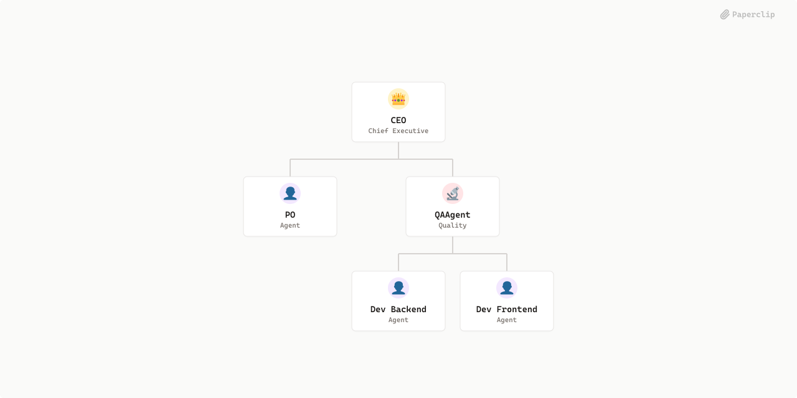

# Compania dos Devs



## What's Inside

> This is an [Agent Company](https://agentcompanies.io) package from [Paperclip](https://paperclip.ing)

| Content | Count |
|---------|-------|
| Agents | 5 |
| Projects | 1 |
| Skills | 4 |

### Agents

| Agent | Role | Reports To |
|-------|------|------------|
| CEO | CEO | — |
| Dev Backend | general | qaagent |
| Dev Frontend | general | qaagent |
| PO | general | ceo |
| QAAgent | qa | ceo |

### Projects

- **DocumentoInteligente** — Será aplicação que terá com sua principal funcionalidade criar documento com busca de conteudo usando IA para fazer conteudo, tera facilidade de acesso a base usando mcp para ajuda ai gera grafico e escrita melhor, tera diversas formatação similar ao word ou tera formatação persolizavel ja definida&#x20;

### Skills

| Skill | Description | Source |
|-------|-------------|--------|
| paperclip-create-agent | > | [github](https://github.com/paperclipai/paperclip/tree/master/skills/paperclip-create-agent) |
| paperclip-create-plugin | > | [github](https://github.com/paperclipai/paperclip/tree/master/skills/paperclip-create-plugin) |
| paperclip | > | [github](https://github.com/paperclipai/paperclip/tree/master/skills/paperclip) |
| para-memory-files | > | [github](https://github.com/paperclipai/paperclip/tree/master/skills/para-memory-files) |

## Getting Started

```bash
pnpm paperclipai company import this-github-url-or-folder
```

See [Paperclip](https://paperclip.ing) for more information.

---
Exported from [Paperclip](https://paperclip.ing) on 2026-04-01
